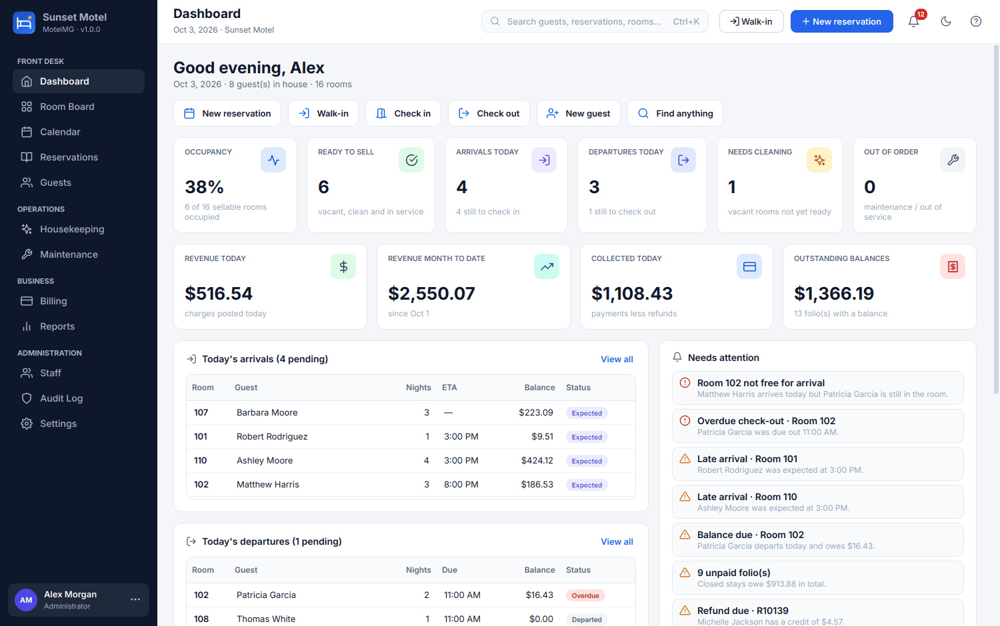
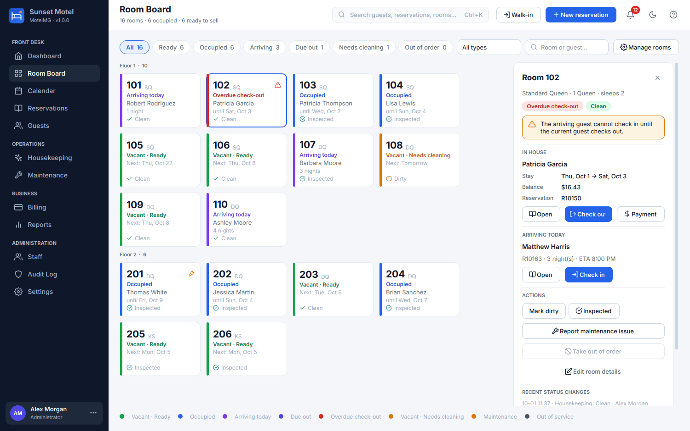
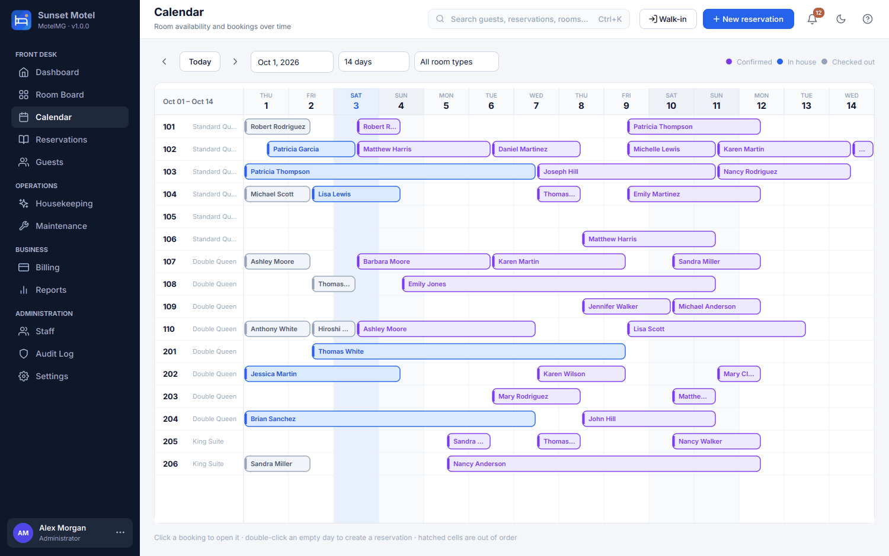
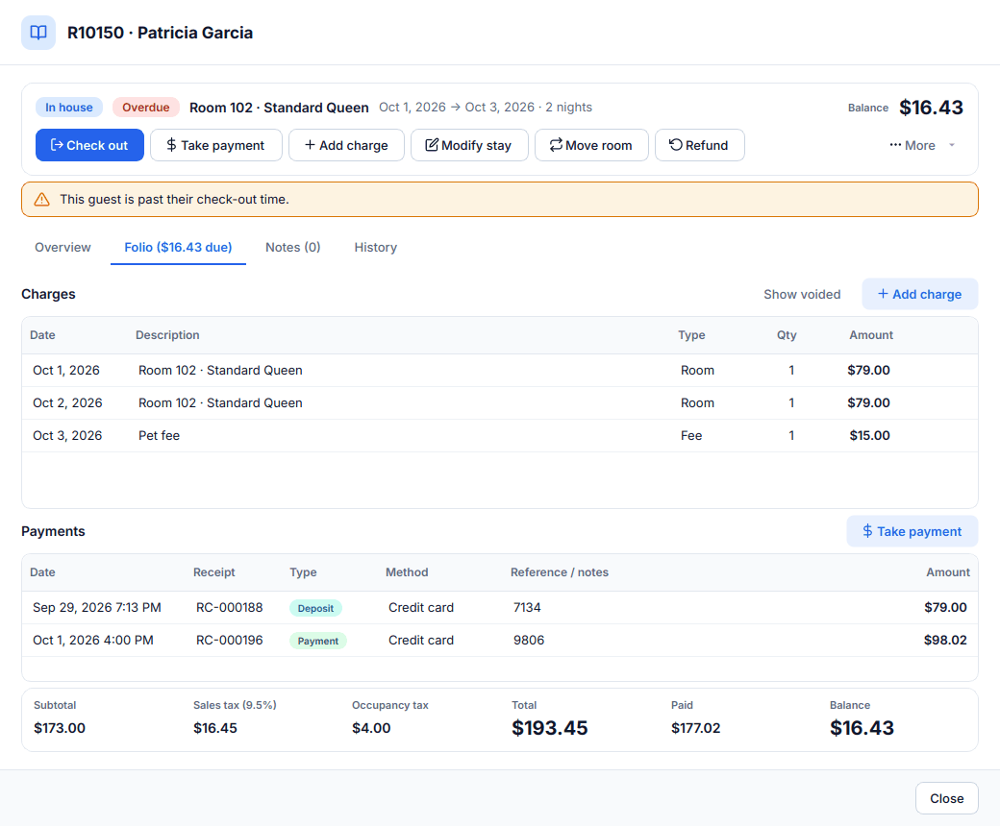
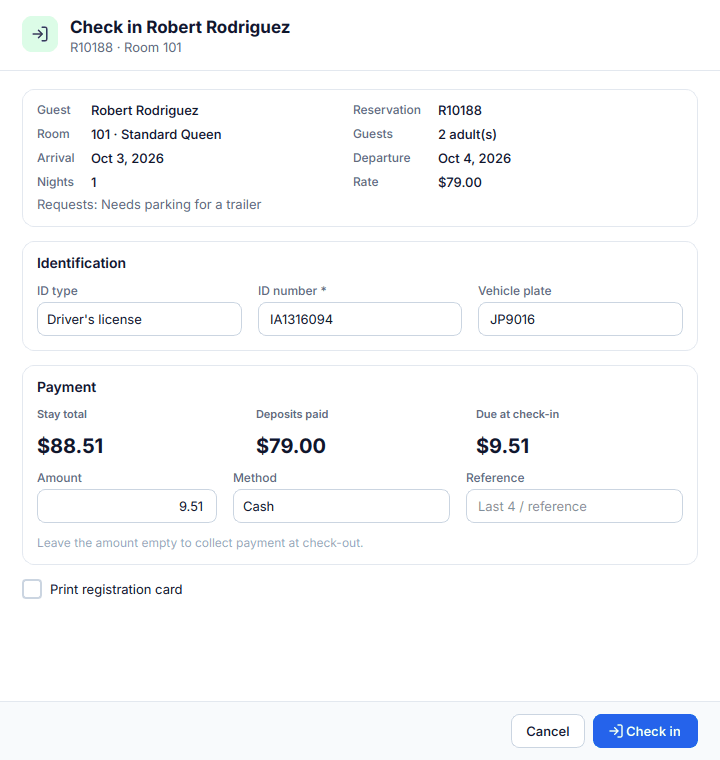
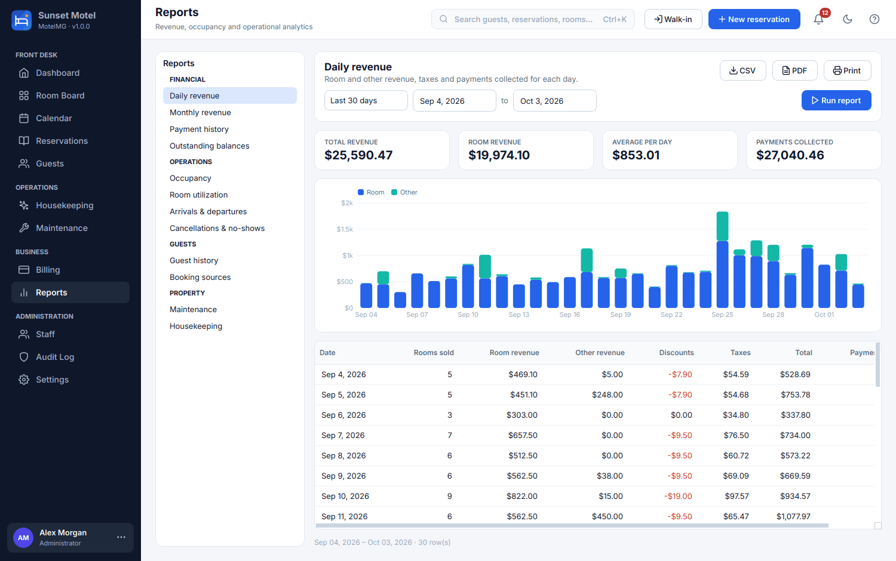
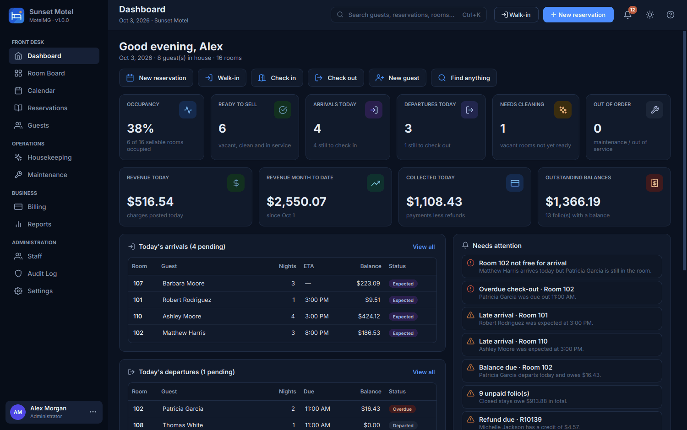

# MotelMG — Motel Management System

MotelMG is a complete desktop application for running a motel: reservations,
check-in/check-out, room status, guest folios and payments, housekeeping,
maintenance, reports, staff accounts and backups. It installs like any other
desktop program and is ready to use after a short first-launch wizard. You
don't need a database server, a terminal or any configuration files.



| Room board | Availability calendar |
|---|---|
|  |  |
| **Guest folio** | **Check-in** |
|  |  |
| **Reports** | **Dark theme** |
|  |  |

---

## Installing

Download the installer for your system from the project's **Releases** page
(the GitHub Actions workflow builds one for each platform):

| System | File | How to install |
|---|---|---|
| Windows 10/11 | `MotelMG-Setup-<version>.exe` | Run the installer. MotelMG appears in the Start menu, and the installer can also add a desktop shortcut. |
| macOS | `MotelMG-<version>-macos-<arch>.dmg` | Open the disk image and drag **MotelMG** into **Applications**. |
| Linux | `MotelMG-<version>-x86_64.AppImage` | Mark it as executable (right-click → Properties → Permissions) and double-click it. |

The first time it starts, MotelMG:

1. creates its database automatically;
2. opens a **setup wizard** that asks for your motel's details, an
   administrator login, your currency, taxes and check-in/check-out times,
   your room types and rates, and your room numbers. Sensible defaults are
   pre-filled, and you can also load **sample data** to explore the system;
3. opens the dashboard, signed in as the administrator.

### Where is my data?

Everything is stored in a single SQLite database file in your user profile:

| System | Folder |
|---|---|
| Windows | `%LOCALAPPDATA%\MotelMG` |
| macOS | `~/Library/Application Support/MotelMG` |
| Linux | `~/.local/share/MotelMG` |

Uninstalling the application never deletes this folder. You can see the exact
path under **Settings › About**. If you put a file named `portable.txt` next
to the executable, MotelMG keeps its data in a `data` folder beside it
instead, which suits running it from a USB drive.

---

## Features

**Front desk**
- Dashboard with occupancy, rooms ready to sell, arrivals and departures,
  rooms needing cleaning, out-of-order rooms, revenue, outstanding balances,
  alerts and quick actions
- A **room board** showing every room's state (vacant/ready, occupied,
  arriving, due out, overdue, needs cleaning, maintenance, out of service).
  Clicking a room opens a detail panel with every action for it.
- An **availability calendar** (tape chart). Click a booking to open it;
  double-click an empty day to book that room.
- Reservations with a live availability check and price quote. Rooms are
  assigned at booking time and can be changed later. Each booking records a
  booking source, discounts, special requests and notes.
- Walk-ins (register and check in a guest in one step); early check-in and
  late check-out fees; late arrivals; early departures; extra nights;
  late check-out approvals
- Room transfers during a stay. Nights from the transfer onward are re-posted
  to the new room, and the old room goes to housekeeping.
- Cancellations with an optional fee and deposit refund; no-shows; a way to
  reinstate a cancelled booking; and same-day undo of a check-in made by
  mistake
- Global search (Ctrl+K) across guests, reservations, rooms, receipts and
  maintenance tickets

**Guests**
- Profiles with contact details, ID document, vehicle plate, preferences, VIP
  status and a *do-not-rent* flag
- Duplicate detection (email, phone, ID number, name), stay history with
  lifetime spend, and notes, including important notes that are highlighted
  at check-in

**Billing**
- Nightly rates set per room type, with optional per-room overrides; rate
  overrides require a permission
- Percentage taxes and fixed per-night taxes, posted line by line so invoices
  never change after the fact
- A configurable catalog of fees and extras, some of which can be added
  automatically each night or once per stay; discounts; adjustments
- Deposits, partial payments, refunds, voids (with reasons), several payment
  methods, and cash change calculation
- Invoices numbered automatically at check-out, payment receipts and
  registration cards. Each can be printed or saved as PDF or HTML.
- Transaction history, outstanding balances and an invoice list

**Housekeeping and maintenance**
- Checking a guest out marks the room dirty and creates a cleaning task. The
  task is flagged urgent when another guest arrives in that room today.
- Assign tasks to housekeepers, who start and complete them; supervisors
  inspect rooms and pass them or send them back. An optional policy requires
  inspection before a room can be sold.
- Daily task generation (stayover service for occupied rooms)
- Maintenance tickets with category, priority, assignee, cost and resolution.
  A ticket can **block its room**, which takes the room out of inventory and
  lists any affected bookings so they can be moved. When the ticket is
  closed, the room returns to service and is sent to housekeeping.

**Reports** (viewable on screen, and exportable as CSV, PDF or print)
- Daily revenue, monthly revenue (with ADR and RevPAR), payment history and
  outstanding balances
- Occupancy (including a forecast for future dates), room utilization, and
  arrivals and departures
- Cancellation and no-show statistics, guest history and booking sources
- Maintenance and housekeeping reports

**Staff and security**
- Sign-in accounts, with lockout after repeated failed attempts, password
  rules, forced password changes and auto-lock after a period of inactivity
- Roles with fine-grained permissions (Administrator, Manager, Front Desk,
  Housekeeping, Maintenance, plus custom roles). Users can't grant
  permissions they don't hold themselves.
- An **audit log** recording every important action and the staff member who
  performed it

**Alerts**
- Overdue check-outs, booking conflicts (such as a reservation in an
  out-of-order room, or an arrival whose room is still occupied), arrivals
  expected soon and late arrivals, possible no-shows, unpaid balances,
  refunds due, dirty rooms with arrivals, urgent maintenance, and backup
  status
- Each alert type can be switched on or off, and individual alerts can be
  dismissed for the day

**Settings**: property details; rooms and rates; taxes, fees and discounts;
payment methods; front desk policies; invoice and receipt wording and
numbering; notifications; currency and date formats; theme (light, dark or
system); auto-lock; backup schedule.

**Backups**: automatic backups (daily, weekly or on exit) with a retention
limit, plus manual backups, restoring from the list or from any file, and a
database integrity check. Restoring always saves a safety copy of the current
data first.

### Keyboard shortcuts

| Keys | Action |
|---|---|
| Ctrl+K / Ctrl+F | Search everything |
| Ctrl+N | New reservation |
| Ctrl+Shift+N | Walk-in |
| Ctrl+G | New guest |
| Ctrl+1 … Ctrl+9 | Switch section |
| F5 | Refresh |
| Ctrl+L | Lock screen |
| Ctrl+P | Print the current report |
| F1 | Shortcut help |

---

## For developers

### Run from source

```bash
python -m venv .venv
source .venv/bin/activate            # Windows: .venv\Scripts\activate
pip install -r requirements-dev.txt
python -m motelmg                    # optional: --data-dir ./devdata
```

On Linux, Qt needs a few system libraries:
`sudo apt install libegl1 libgl1 libxkbcommon0 libfontconfig1 libdbus-1-3 libxcb-cursor0`.

### Tests

```bash
QT_QPA_PLATFORM=offscreen pytest     # 93 tests: services, database, security and GUI workflows
ruff check motelmg tests packaging
```

The suite covers the whole guest lifecycle:
guest → reservation → room assignment → check-in → charges → payment →
check-out → invoice → housekeeping → inspection → room available again.
It also covers cancellations, modifications, transfers, maintenance blocks,
permissions and privilege escalation, persistence across restarts, invalid
input, booking conflicts (enforced by database triggers as well as by the
services), backup and restore, every report, and the setup wizard. The GUI
tests drive the real dialogs with pytest-qt.

`MotelMG --self-test` runs a headless diagnostic. It builds a demo database
in a temporary folder, renders every page in both themes, exports a PDF and
creates a backup. CI runs it against the packaged application.

### Build the installers

```bash
python packaging/build.py
```

The build script produces the installer for the platform it runs on:

| Platform | Output | Requirements |
|---|---|---|
| Windows | `dist/MotelMG-Setup-<version>.exe` | [Inno Setup 6](https://jrsoftware.org/isinfo.php) (without it, the script makes a portable `.zip` instead) |
| macOS | `dist/MotelMG-<version>-macos-<arch>.dmg` | — |
| Linux | `dist/MotelMG-<version>-x86_64.AppImage` | — (`appimagetool` is downloaded automatically; falls back to a `.tar.gz`) |

`.github/workflows/build.yml` runs the linter and tests, builds and smoke-tests
the installers on Windows, macOS and Linux, and attaches them to a GitHub
release when a tag like `v1.0.0` is pushed.

### Architecture

```
motelmg/
├── core/          framework-free building blocks: errors, money (integer cents), dates,
│                  validation, permissions catalog, status enums, configuration defaults
├── data/          SQLite access: connection/transactions, schema + migrations, seed data,
│   └── repositories/   all SQL lives here (one repository per aggregate)
│                  backup.py (online backup / verify / restore)
├── services/      business logic: reservations, billing (posting engine), pricing (pure),
│                  rooms, guests, housekeeping, maintenance, auth, users, alerts, reports,
│                  search, dashboard, backups, setup wizard, demo data
├── reporting/     invoices, receipts, registration cards, report printouts, CSV export
├── ui/            PySide6 GUI: theme (light/dark design tokens), icons, reusable widgets,
│   ├── pages/     one module per sidebar section
│   └── dialogs/   task dialogs (reservation, check-in/out, payments, ...)
└── main.py        start-up: logging, crash handler, single instance, DB recovery, flow
```

- **Layering.** The GUI only calls services. Services validate input, check
  permissions, run transactions and write audit entries, and they never
  import Qt. Repositories hold all the SQL.
- **Integrity in the database.** Integrity is enforced in SQLite as well as in
  Python:
  - foreign keys and CHECK constraints
  - partial unique indexes: one in-house guest per room, one posted charge
    per room night, and one open housekeeping task of each type per room
  - triggers that make double-booking impossible
- **Money.** Amounts are stored as integer cents and percentages as basis
  points. Quotes and posted charges share the same pure pricing functions,
  so a guest's quoted price always matches the folio.
- **Migrations.** Schema changes are versioned with `PRAGMA user_version`.
  Each upgrade runs in a transaction, after an automatic safety copy of the
  database.

## License

The bundled Inter font is licensed under the SIL Open Font License (see
`motelmg/resources/fonts/OFL-Inter-LICENSE.txt`).
